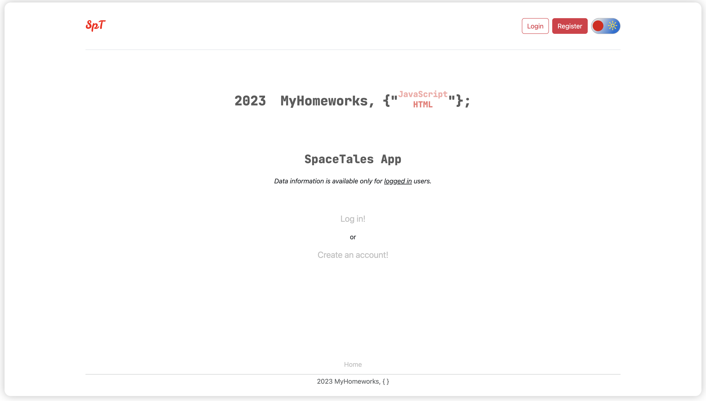
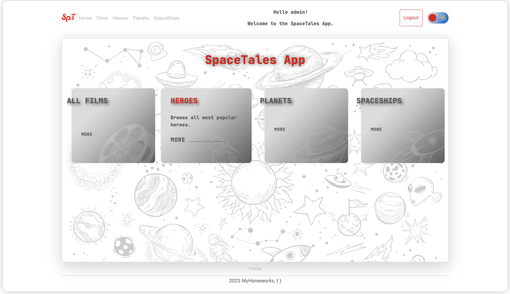
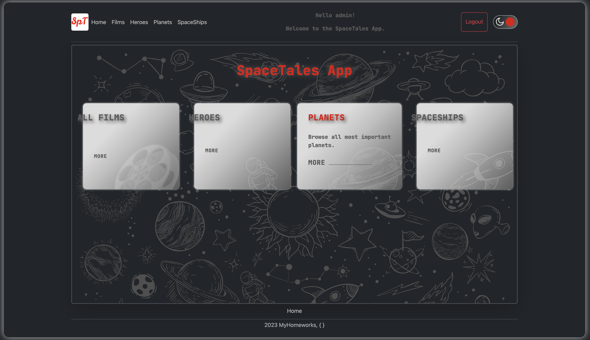
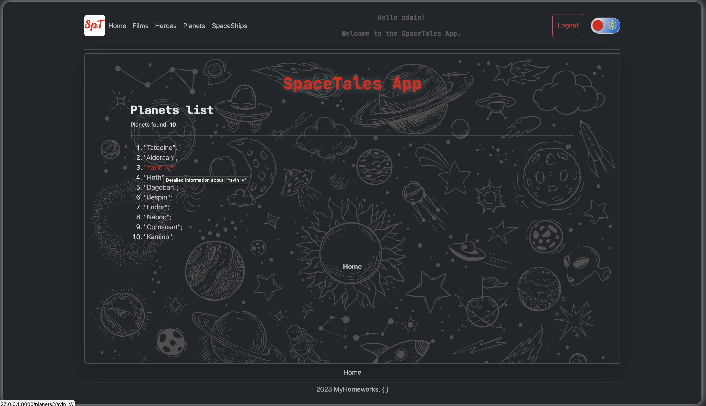
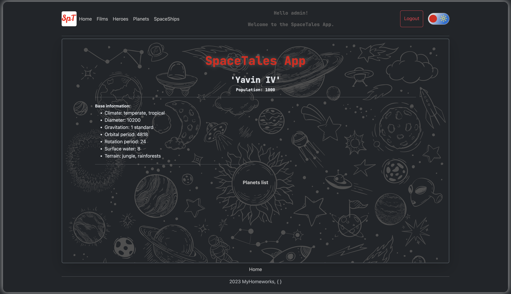

## Description
This is a Django test project using SQLite, Docker and ['The Star Wars API'](https://swapi.dev/).


## Launch instructions


1. Clone repository to your local folder;
2. For this step you should already have installed Docker and docker-compose on your PC:
- make sure You are in project folder: ```cd 'root project folder' ```;
- Run docker-compose: ```docker-compose up --build```;
- Installation can take some time, it depends on your PC resources;
- After the installation is completed, the server will start automatically on 0.0.0.0:8800;
- Open app using http://0.0.0.0:8800/ in your browser;
3. The superuser does not exist;
- You can manually create superuser for Your own purpose: ```cd 'root project folder' && python3 manage.py createsuperuser``` ;
4. Note that DataBase - sqlite3;
5. To stop the server: ```Ctrl+C```;
6. To completely remove all created docker containers, images and volumes: ```docker-compose down --volumes```.

### Screenshots 

1. Main page


2. Select part


3. Select part(Dark theme)


4. Data


5. Detailed data

